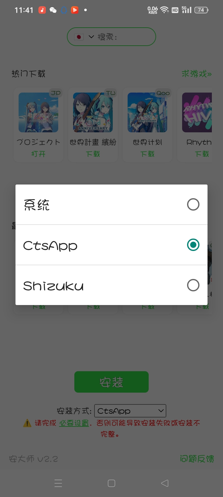

# 安装方案（使用前必看）

> [!NOTE]
> 在选择和使用安装方案前，请根据实际情况和所使用的机型选择合适的安装方案

安装软件后，首次使用或中间下方分别有三种安装方案

不同的安装方案有不同的步骤、以及上手难度等，分别有系统原始安装，Cts套件和Shizuku等三种方案，使用此软件方案时，按照不同机型，实际情况等选择可适配的方案

## 下载（副页）

官方：https://xapk.io/apk/xapk-installer.apk

网盘镜像下载点

下载1：https://share.weiyun.com/IQiCj8q4

下载2：https://pan.huang1111.cn/s/752voTg

## 安装方案目录

[原系统自带](cha2.md)

[Cts套件安装方案](cha3.md)

[Shizuku安装方案](cha.md)
